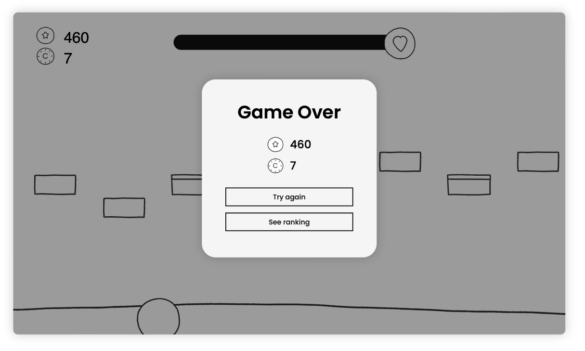

# Run Through Gravity 🎮

Run Through Gravity is a keyboard-playing arcade game going down the stairs following gravity.

### DEMO IS HERE! ☄️

[Visit our demo](https://runthroughgravity.web.app) and feel free to put feedback as github issues.

> One day the invasion began from the unknown.
> While running away, you found the only escape stairway.
> Escape as fast as you can!
> But watch out the gravity direction, you can only **going down** the stairs.
>  **Tip⚠️** If you face a stair that goes up, change the direction of gravity

 

### How to play?

You will use only three keys during the game. The space bar is used to go down the stairs, and the arrow is used to change the direction of gravity.

- `Space bar`
  : go down the 1 stair block
- `Upward arrow`
  : change the gravity direction to upward
- `Downward arrow`
  : change the gravity direction to downward

If you try to go up the stairs, you will fall to the floor. If you face the stairs going up, **change the direction of gravity and go down**.

Followings are the tips for you 😊

1. You should catch up the gravity direction by reading the map drawing
2. If the relative position of next stair step is same with gravity direction, just go down the stair by pressing spacebar once.
   
3. If the relative position of next stair step is different from graviy direction, in other words, if it is trying to go up the stair, then change the gravity direction to opposite.
   
   - If the current direction is downward, make upward by pressing upward-arrow key
   - If the current direction is upward, make downward by pressing downward-arrow key
4. After change gravity direction, then go down the stairs.

### How to get points?

The game will count **how many steps of stairs did you go down**. It will be applied to you final score.
Your life will be decreased linearly dependent on time. So **move fast as much as you can.** If you make the correct move, your life will be increased.
If you make the wrong move or the life goes zero, then the game will end.

### How to check my rank?

If you move to mypage, you can check your current coins and max score that you made on the leftside.
Your global rank will be shown on the rightside.  

---

### Implementation

This project is built with pure **Javascript, Html, and CSS**.
The game is implemented based on **p5.js**.
Login service and user database are managed by Firebase.

This project adapts observer pattern to manage game objects.
The function implementation is as follows.

1. Implement object factory for produce random block
2. Implement observing for detect various events(move, fall, die, coin, etc.)

- construct 6 objects with below realtion, arrow indicates observing direction
  
- map object mainly operates the game,
  1. detect user's move
  2. check the correction
  3. notify the move to observer and make animation

3. Use async, await keyword for file loading(sound, gif, etc.) before game start
4. Use gif animation and sound for dynamic game play
